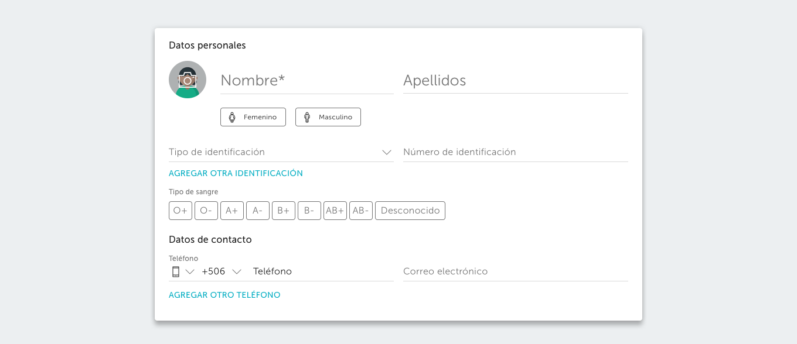
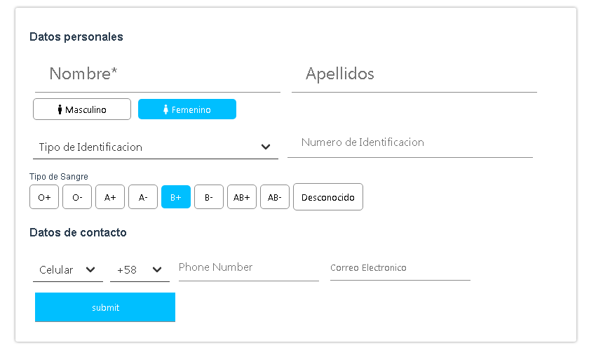

# VUEX USER REGISTRATION SYSTEM

> Run your client and server with a single command

## Quick Start

``` bash
# Install dependencies for client
yarn install

# Compiles and hot-reloads for development
yarn run serve

# Compiles and minifies for production
yarn run build

# Linits and fixes files
yarn run lint

# Client on http://localhost:8080
```

## Folder Distribution

The workflow I currently use is the same as VUE-CLI which is as follows:

- public
    - index.html 
- src
    - components
        Form.vue
    - App.vue
    - main.js
    - store.js

## What is this app about

We're creating an application that registers users and add them inside a store that's accesible through a Local Storage.



This app needs to fulfill certain conditions:

- Design it based on the image above.
- Use Vuex to create one central place where every component can access their data.
- Save the information on a Local Storage.
- Include validation so that the email is valid.
- Include validation so that the phone number has Venezuela's format.

## How each condition was done.

- The design was suggested to be made using Material Design, but it had some issues while using it causing more trouble than good, so this app was made using Vanilla CSS and the framework Bulma for the select tag.

- The store had the following state:

```bash
state: {
        newUser: {
            firstName: '',
            lastName: '',
            gender: '',
            idType: '',
            idNumber: '',
            bloodType: '',
            phoneType: 'Celular',
            countryCode: '+58',
            phoneNumber: '',
            email: ''
        },
        user: []
    }
```
The logic is that we use a **newUser** object to take all the inputs from the user and then take that object and push it into the **user** array of objects

Each input was communicated with the store through the v-model using mutations which is the only one allowed to modify the store.

An example on how the communication was done can be seen in the following code:

```bash
    <input type="text" v-model="firstName" placeholder="Nombre*"/>
```

Then we called an mutation:

```bash
    computed: {
        firstName: {
            get () {
                return this.$store.state.newUser.firstName
            },
            set (value) {
                this.$store.commit('updateFirstName', value)
            }
        },
        lastName: {
            get () {
                return this.$store.state.newUser.lastName
            },
            set (value) {
                this.$store.commit('updateLastName', value)
            }
        }
    }
```

Which look like this in the store:

```bash
mutations: {
    updateFirstName (state, firstName) {
        state.newUser.firstName = firstName
    },
    updateLastName (state, lastName) {
        state.newUser.lastName = lastName
    }
}
```

For the buttons it was different but the logic is pretty much the same except we're using actions.

```bash
<button 
    class="gender" 
    value="male" 
    @click="addGender"
    v-bind:class="{ active: genderActive.male }"><span><font-awesome-icon icon="male" /></span>Masculino</button>
<button 
    class="gender" 
    value="female" 
    @click="addGender"
    v-bind:class="{ active: genderActive.female }"><span><font-awesome-icon icon="female" /></span>Femenino</button>
```

We call an action called **addGender**. Vuex has a helper that makes this communication easier called **mapActions**:

```bash
methods: {
    ...mapActions([
      'addUser',
      'addGender',
      'addBloodType'
    ])
  }
```

In the store **addGender** looks like this:

```bash
mutations: {
    addGender (state, e) {
        state.newUser.gender = e.path[0].value;
        e.preventDefault();
    }
},
actions: {
    addGender: function(context, e) {
        context.commit('addGender', e)
    }
}
```

- Adding a Local Storage.

We used "vuex-persistedstate" to communicate the Vuex store directly with the Local Storage, just following the instructions is enough to make it work. It basically copies whatever is in the **state** to the Local Storage.

- Validate email.
  
We used the default options of the HTML to include the "@" symbol, but due to time, this app doesn't have the validation aspect to detect if the same email is stored inside the state.

- Validate phone number format.

For the same reason as above this aspect is delayed. For now there's a tool called "Vuelidate" that can make the validation easier.

- Communicate at least two components through the store.

In this case the route opted was having one big component called Form, but now it can be seen that dividing the app into multiple components is much more efficent, having an Input component, a Select component, a Button Radio component, can make the code look much more elegant and its the reason frameworks like Vue and React are so popular. This aspect was not considered, but it will in a future update

## What needs to be done.

- Include validation on names, email, repetitive information in the store.
- Include a data base, in this case Firebase is a great choice for Vue in general.
- Fix some styling issues, its hard coded and not responsive in a fluid way as it should be. Considering the app will be divided into different components in the future (I will work back on this app in two weeks due to IRL situations), Material Design will be applied just as an excuse to learn it. As of now its highly prefered working using only Vanilla CSS.

## The APP looks like this now.



## Closure

This app did not meet all the criterias for the challenge given, but it was a perfect oportunity to learn a framework like Vue and a State Management like Vuex in less than two weeks.

The functionality regardging the use of Vue/Vuex was satisfactory on the other hand and it will be a base to create more complex apps.

**Made by Adrian Beria.**

**React js Front-End Web Developer.**